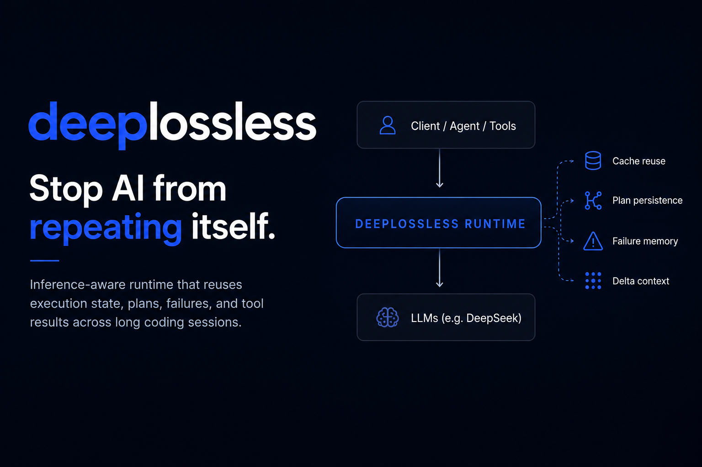

# deeplossless

DeepLossless is an **inference-aware coding runtime** that reduces repeated
work in long AI coding sessions. It sits as an OpenAI-compatible proxy between
your client and the DeepSeek API.

```bash
cargo install deeplossless
deeplossless --api-key sk-...
# Point any OpenAI-compatible client at http://127.0.0.1:8080/v1
```

Most coding tokens are spent reconstructing already-known state — rereading
unchanged files, replanning the same tasks, retrying known-bad fixes.
DeepLossless reuses failures, tool results, execution state, and plans instead
of recomputing them every turn.

Long context windows are not memory. Repeated inference is waste.

```
Long coding session (3 tasks, 86 turns)

Vanilla Agent                          DeepLossless Runtime
────────────────────────────────────── ──────────────────────────────────────
21,070 tokens                          13,500 tokens
14 repeated replans                    5 replans
8 repeated failures                    3 failures
11 repo rereads                        9 rereads avoided

                                       ↓36% total tokens
                                       ↓64% replanning
                                       ↓62% repeated failures
```

Run it yourself — no API key, no proxy setup:

```bash
git clone https://github.com/gordonlu/deeplossless.git && cd deeplossless
cargo test --test long_session_benchmark -- --nocapture
```

Want to see what the runtime actually does? `cargo test --test simulated_session -- --nocapture`

## What actually gets reused?

DeepLossless reuses:

- **repeated tool calls** — stream-level interception replaces cached tool calls inline
- **file reads** — structured summaries (AST symbols, line counts) instead of raw content
- **failed fix attempts** — failure memory stores why_failed + invalidated_assumptions
- **execution plans** — plan state persists across turns, avoids replanning
- **execution events** — append-only event sourcing enables deterministic replay
- **summarized reasoning traces** — execution compaction distills outcomes

Instead of recomputing them every turn.

## Quick start

```bash
# Try without API key first — runs a local demo
deeplossless demo

# Proxy mode: set once, never type again
export DEEPSEEK_API_KEY=sk-...
deeplossless

# Or pass it on the first run (extracted from the first request's
# Authorization header on subsequent runs — no need to retype)
```

OpenAI-compatible clients: point `base_url` to `http://127.0.0.1:8080/v1`.

## Design Principles

- **Reasoning is expensive.** Don't redo it.
- **Repeated inference is waste.** Cache it.
- **Context windows are not memory.** Execution state is.
- **Stable execution state beats repeated replanning.**
- **Runtime policy should optimize, not control.** Advisory, configurable, overrideable.
- **Compression alone is insufficient.** Need reuse, avoidance, and distillation.
- **Incremental reasoning is more scalable than ever-growing context.**
- **Inspired more by incremental compilation than traditional chat memory.**

## Architecture

DeepLossless operates in two layers, sitting as an OpenAI-compatible proxy
between your client and the DeepSeek API:

### Layer 1: Memory (store & organize)

| Component | Role |
|-----------|------|
| **Semantic DAG** | True shared graph with embedding-based dedup (cosine ≥0.85 auto-merge), BM25 retrieval, sentence-level provenance spans |
| **Tree-sitter AST extraction** | 8 languages (Rust, Python, TS, JS, Java, C/C++, C#, Go) — precise function/class/type signatures extracted before compression |
| **Entropy-aware compaction** | Trigram novelty scoring — novel content preserved, redundant content aggressively compressed |
| **Memory scoring** | Access count + recency + importance with decay-based GC. Three-tier retention |
| **Code diff memory** | Stores what *changed* (file, diff, symbols, errors), not full code blocks |

### Layer 2: Runtime (optimize execution)

| Component | Role |
|-----------|------|
| **Tool Result Cache** | Deterministic `hash(tool + args)` cache with partial file-based invalidation. Zero-token reuse for grep/read_file/search |
| **Failure Memory** | Stores failed reasoning paths (`why_failed` + `invalidated_assumptions`), not just error strings. Prevents error loop token waste |
| **Plan Persistence** | Execution state (goal, steps, assumptions), not plan text. Avoids repeated planning |
| **Execution Units** | Agent memory atoms: `think → act → observe → reflect` cycles with outcome inference |
| **Runtime Policy** | Advisory decisions with confidence scores + estimated token savings |
| **Event Sourcing** | Append-only execution_events table — every StreamEvent persisted for replay |
| **Replay Engine** | Deterministic reconstruction of execution sequences from event log |
| **Snapshot Isolation** | Copy-on-write memory versions with budget-aware retention tiers (L0–L3) |

## Runtime Strategies

DeepLossless does not force optimization. The runtime policy layer is **advisory
and configurable**: users can prioritize token efficiency, exploratory reasoning,
or autonomous execution depending on workload. The agent/UI can accept, ignore,
or override each recommendation.

| Profile | Cache | Retries | Speculative | Context | Freeze Plans | Token Budget |
|---------|-------|---------|-------------|---------|-------------|-------------|
| **Minimal** | 100% | 1 | No | 20% | Yes | 30% |
| **Efficient** | 80% | 2 | No | 50% | No | 60% |
| **Exploratory** | 50% | 3 | Yes | 80% | No | 80% |
| **Autonomous** | 30% | 5 | Yes | 100% | No | 95% |
| **Custom** | user-defined | user-defined | user-defined | user-defined | user-defined | user-defined |

Set via `RUNTIME_PROFILE=minimal|efficient|exploratory|autonomous|custom`.
Custom: `RUNTIME_CACHE=0-1 RUNTIME_RETRIES=0-10 RUNTIME_SPECULATIVE=true|false RUNTIME_CONTEXT=0-1 RUNTIME_FREEZE=true|false RUNTIME_BUDGET=0.1-1`

## Configuration

| Argument | Default | Description |
|----------|---------|-------------|
| `--host` | `127.0.0.1` | Listen address |
| `--port` | `8080` | Listen port |
| `--upstream` | `https://api.deepseek.com` | Upstream API base URL |
| `--db-path` | `~/.deeplossless/lcm.db` | SQLite database path |
| `--api-key` | `DEEPSEEK_API_KEY` | API key. Set once via env var, no need to retype each run |
| `--admin-key` | `ADMIN_KEY` | Admin key for LCM endpoints (falls back to API key) |
| `--rate-limit` | `100` | Max requests/second (0 disables) |
| `--summarizer-model` | `deepseek-v4-pro` | Model for background LLM summarization |
| `--dry-run` | disabled | Skip upstream, save translated body for offline debugging |
| `--log-dir` | disabled | Enable per-request JSON logging to a directory |

## API

### Proxy

```
POST /v1/chat/completions     — OpenAI-compatible proxy, SSE streaming, DAG context injected
POST /v1/responses            — Responses API → Chat Completions (enables Codex + DeepSeek)
```

Codex uses the Responses API natively. deeplossless translates it to Chat Completions
internally, so Codex works with DeepSeek without any Codex-side configuration.
Model names are auto-mapped: `gpt-5*` → `deepseek-v4-pro`, `gpt-*-mini` → `deepseek-v4-flash`.

### Memory

```
GET  /v1/lcm/grep/{conv_id}?query=     — FTS5 BM25 full-text search
GET  /v1/lcm/expand/{node_id}          — Expand summary to children
GET  /v1/lcm/status/{conv_id}          — DAG health (tokens, leaves, level)
GET  /v1/lcm/snippets/{node_id}        — View extracted precision-critical values
GET  /v1/lcm/trace/{node_id}           — Sentence-level provenance with source excerpts
GET  /v1/lcm/stream/{conv_id}?budget=  — Streaming DAG context (SSE incremental delivery)
```

### Runtime

```
GET  /v1/lcm/global/search?q=&limit=     — Cross-session semantic search
GET  /v1/lcm/execution/search?q=         — Execution memory: bugs, tool chains, code edits
GET  /v1/lcm/runtime/stats               — Runtime metrics (tokens, cache rate, failures)
GET  /v1/lcm/runtime/report?conv_id=&format= — Session report (markdown or SVG share card)
GET  /v1/lcm/runtime/debug-dump          — Structured dump for GitHub issues (no user content)
```

### Replay

```
GET  /v1/lcm/replay/{execution_id}         — Reconstruct execution from event log
POST /v1/lcm/snapshot                       — Take an execution snapshot
GET  /v1/lcm/versions                       — List memory version history
```

### Agent hooks

```
GET  /v1/lcm/cache?tool=&args=           — Check tool cache before execution
POST /v1/lcm/cache/put                   — Store tool result after execution
POST /v1/lcm/failure                     — Record failure pattern (auto-detected by pipeline)
POST /v1/lcm/plan                        — Store execution plan
GET  /v1/lcm/plan/{conv_id}              — Read active plan
POST /v1/lcm/file/claim                  — Claim file ownership (409 if conflict)
POST /v1/lcm/file/release                — Release file ownership
GET  /v1/lcm/file/conflicts              — List active file claims
```

### Operations

```
POST /v1/lcm/compress  {conv_id, from, to}  — Compress node range (LLM summarization)
POST /v1/lcm/delete    {conv_id, id}        — Soft-delete from active context
POST /v1/lcm/rollback  {conv_id, id}        — Rollback to checkpoint
POST /health                                — Health check (DB, upstream, compactor)
GET  /metrics                               — Prometheus metrics
```

## Codex + DeepSeek

deeplossless can translate OpenAI's Responses API to Chat Completions, enabling
Codex to work with DeepSeek. Model names are auto-mapped: `gpt-5*` →
`deepseek-v4-pro`, `gpt-*-mini` → `deepseek-v4-flash`.

```bash
# 1. Start deeplossless
deeplossless --api-key sk-...

# 2. Codex config (~/.codex/config.toml)
[model_providers.localproxy]
name = "deeplossless"
base_url = "http://127.0.0.1:8080/v1"
wire_api = "responses"
env_key = "DEEPSEEK_API_KEY"

[model_providers.localproxy.models.gpt-5]
# Codex will use this model name, deeplossless remaps it

# 3. Run
codex
```

### Limitations with Codex

Codex uses a **client-side execution model** — tool calls, retries, and plan
state are managed inside the Codex process. deeplossless operates at the
canonical IR layer between Codex and DeepSeek, so some features work
transparently while others require agent-side LCM API integration:

| Feature | Available via Codex? | How |
|---------|:--:|------|
| Protocol translation (Responses → Chat) | YES | Canonical IR bidirectional translation |
| Tool Cache Interception | YES | Stream-level: detects tool calls, returns cached results inline |
| DAG Context Injection | YES | `<lcm_context>` appended to system messages |
| Pipeline Auto-Caching | YES | Tool results extracted from conversation history automatically |
| Failure Auto-Detection | YES | Pipeline detects error patterns from tool results |
| Tool Cache (manual) | NO | Codex doesn't query `GET /v1/lcm/cache` |
| Failure Memory (manual) | NO | Codex doesn't query failure endpoints |
| Plan Persistence | NO | Codex maintains its own plan state |
| File Ownership Tracking | NO | Unsupported |
| Runtime Policy | NO | Decisions are made by Codex, not the proxy |

Features marked YES work **transparently** — Codex doesn't need to know they
exist. The canonical IR layer intercepts and optimizes at the protocol level.

## Session Report

Generate a shareable recap of what the runtime saved in your session:

```bash
curl http://127.0.0.1:8080/v1/lcm/runtime/report?label=fix+build&turns=50
```

Outputs markdown that you can paste directly into GitHub issues, tweets, or chat:

```markdown
# deeplossless session report: fix build

**50 turns** · **180s duration** · **42% cache reuse**

## Execution Reuse
| Cache hits | 21 |
| Failure loops broken | 3 |
| Plans resumed | 2 |

## Inference Economics
| Estimated tokens avoided | ~8,400 |
| Tokens spent | 12,500 |

## Most Reused
- **grep** — 14x
- **Cargo.toml** — 8x

## Highlights
- Runtime reuse kicked in repeatedly.
- Stopped 3 potential failure loops.
- Prevented 21 redundant tool calls.
```

## Benchmarks

### Scope and methodology

Current benchmarks use a **deterministic local agent loop** to isolate runtime-level
reuse effects (cache reuse, reread avoidance, failure memory, plan persistence)
from model variance. Real-world reductions with external LLMs are expected to be
**lower but follow similar trends**.

We are measuring inference economics, not coding ability. The primary metric is
**how much repeated work the runtime prevents** — not how fast the agent solves
the task.

The next phase will introduce a **semi-real benchmark** with real LLM `think()`
calls and deterministic tool execution, isolating the reasoning reuse layer
from model behavior.

### Inference redundancy benchmark (4 tasks, simulated repos)

```
                    Baseline tokens    Runtime tokens    Reduction
Dependency mismatch      11,602             2,626           ↓77%
Symbol rename             5,105             1,120           ↓78%
Config drift              9,583             2,225           ↓77%
Misleading error          7,074             1,092           ↓85%
──────────────────────────────────────────────────────────
TOTAL                    33,364             7,063           ↓79%
Cache hits: baseline 0, runtime 205. Rereads avoided: 96.
```

Run: `python3 bench/run.py`

### Long session (3 tasks, 86 turns)

```
                    Vanilla Agent    DeepLossless Runtime    Reduction
Token / session         21,070              13,500            ↓36%
Repeated replans           14                   5              ↓64%
Repeated failures           8                   3              ↓62%
Repo rereads               11                   2              ↓82%
Cache hit rate              —                 28%              —
Failures broken             —                   5              —
```

Run: `cargo test --test long_session_benchmark -- --nocapture`

### How to benchmark

```bash
cargo test --test long_session_benchmark -- --nocapture   # 86-turn punchline
cargo test --test simulated_session -- --nocapture         # 20-turn detailed log
cargo bench                                                # micro-benchmarks

# Live runtime metrics (requires proxy running)
curl http://127.0.0.1:8080/v1/lcm/runtime/stats | jq .
```

### Micro-benchmarks (criterion)

```
Token counting (8K lines):          7.8 ms
Snippet extraction (4K lines):      5.8 ms
DAG assembly (1K nodes):          483 μs
Session fingerprint:               124 ns
Runtime cache decision:        sub-microsecond
Runtime full decision cycle:   sub-microsecond
Reasoning distillation (20 calls):  microseconds
```

## Requirements

- Rust 1.80+
- SQLite (bundled)
- DeepSeek API key (for proxy mode; benchmarks run without)

## Attribution

- **LongSeeker** — *Context-ReAct: Elastic Context Orchestration for Long-Horizon Search Agents* (May 2026)
- **LCM Paper** — Ehrlich & Blackman. *LCM: Lossless Context Management* (2026)

## License

MIT
